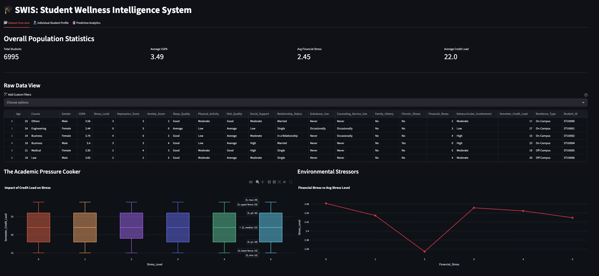
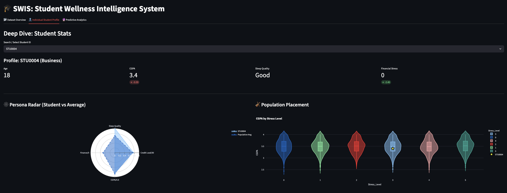
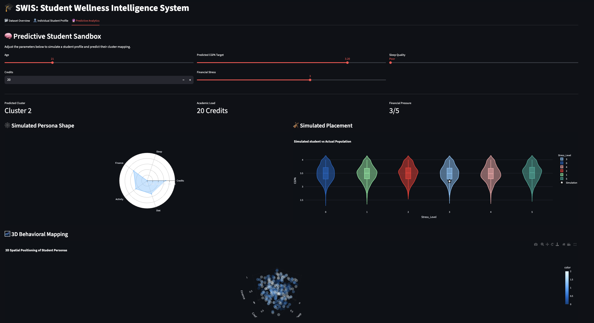

# DAV_10

# SWIS: Student Wellness Intelligence System 🧠📊
### Student Mental Health Analysis Dashboard

Developed by **DAV 10** at **Ahmedabad University**:
* Hardi Makwana
* Lakshita Rathod
* Siddhi Hirani
* Jyoti Triklani

## Overview
This repository contains a Streamlit-based interactive dashboard designed to analyze student mental health metrics. By processing comprehensive survey data (`students_mental_health_survey.csv`), this project explores the correlations between stress levels, depression scores, anxiety, academic performance (CGPA), and lifestyle factors like sleep and diet. 

## Key Features
- **Interactive Data Exploration:** Dynamically view dataset dimensions, categorical/numerical breakdowns, and statistical summaries.
- **Missing Value Handling:** Automated detection and percentage calculation of missing data points to ensure data integrity.
- **Visual Analytics:** Interactive charts and graphs detailing the mental health landscape of students across different courses and demographics.

## Tech Stack
- **Python 3.12**
- **Streamlit** (Interactive Web Dashboard)
- **Pandas & NumPy** (Data Manipulation & Preprocessing)
- **Matplotlib & Seaborn** (Data Visualization)

## Dashboard Previews
### 1. Data Overview

-------------------------------------------------------------------------------------------------------------------------------------------------
### 2. Individual Student Profile

-------------------------------------------------------------------------------------------------------------------------------------------------
### 3. Predictive Analytics



## Installation & Usage

1. **Clone the repository:**
   ```bash
   git clone [https://github.com/your-username/your-repo-name.git](https://github.com/your-username/your-repo-name.git)
   cd your-repo-name

## Installation & Usage

1. **Install the required dependencies:**
   ```bash
   pip install pandas numpy matplotlib seaborn streamlit

2. Run the Streamlit dashboard:
   ```bash
   streamlit run app.py
